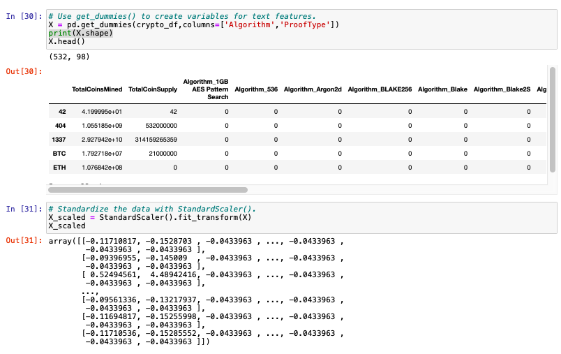
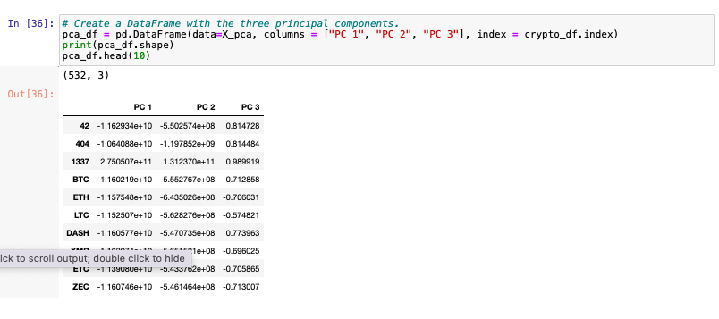
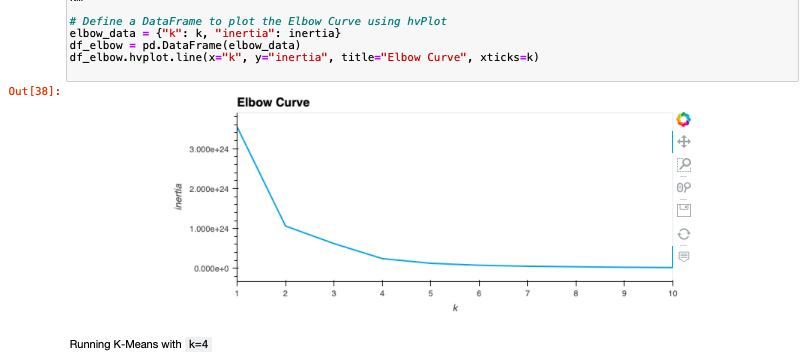
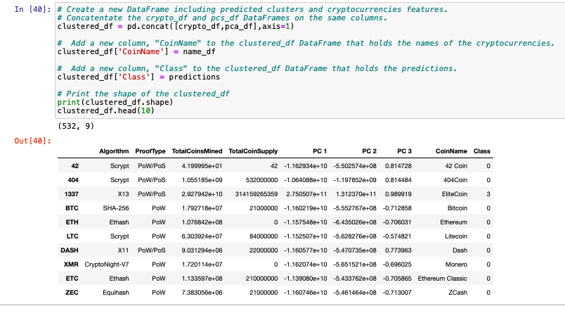
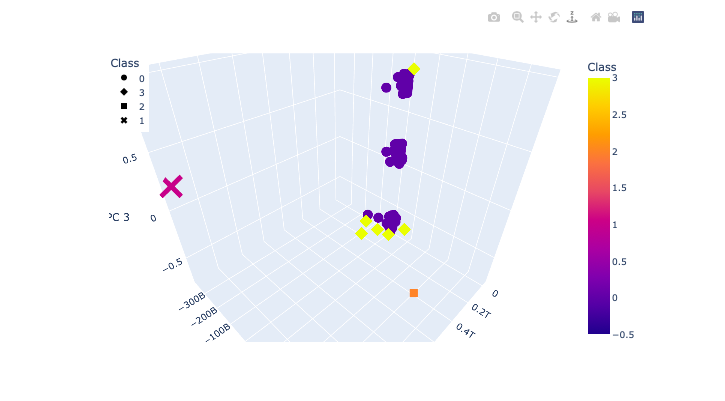
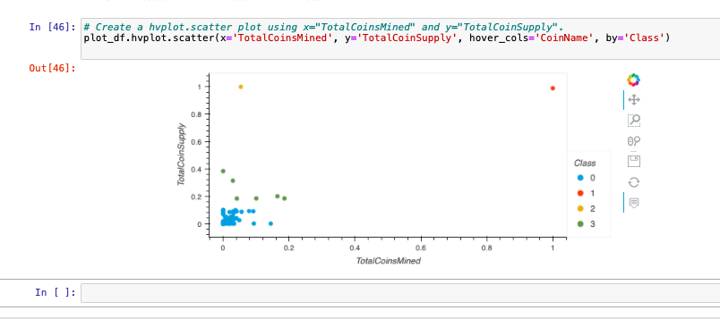

# Cryptocurrencies
Unsupevised Machine Learning to discover cryptocurrency trends 

Accountability Accounting, a prominent investment bank, is interested in offering a new cryptocurrency investment portfolio for its customers. The company, however, is lost in the vast universe of cryptocurrencies. So, they’ve asked me to create a report that includes what cryptocurrencies are on the trading market and how they could be grouped to create a classification system for this new investment.

# Preprocessing the Data for PCA

Using my knowledge of Pandas, I preprocessed the dataset. It is crucial that we preprocess our data before feeding it into our model, as the quality of the data and the relevant information that can be gleaned from it directly influences the model's capacity to learn. During the preprocessing we need to deal with:
* Null values  
* Missing values  
* Standardization: transform the values such that the mean of the values is 0 and the standard deviation is 1.  
* Handling Categorical Variables: Categorical variables are variables that are discrete rather than continuous in nature. For example, an item's color is a discrete variable, while its price is a continuous variable.  

By using cleaning and preprocessing, the amount of data in the dataset was reduced from 1144 rows x 6 columns to 532 rows x 4 columns

 

The get_dummies() method is used to create variables for the text features, which are then stored in a new DataFrame, X 
The features from the X DataFrame have been standardized using the StandardScaler:

 

# Reducing Data Dimensions Using PCA

The PCA algorithm reduces the dimensions of the X DataFrame down to three principal components. The pcs_df DataFrame is created and has the following three columns, PC 1, PC 2, and PC 3, and has the index from the crypto_df DataFrame:

 

# Clustering Cryptocurrencies Using K-means

I created an elbow curve using hvPlot to find the best value for K:

 

I created new DataFrame with the same index as the crypto_df DataFrame and has the following columns: Algorithm, ProofType, TotalCoinsMined, TotalCoinSupply, PC 1, PC 2, PC 3, CoinName, and Class 

 

# Visualizing Cryptocurrencies Results

Using my knowledge of creating scatter plots with Plotly Express and hvplot, I visualized the distinct groups that correspond to the three principal components I created:

 

I created a scatter plot with all the currently tradable cryptocurrencies using the hvplot.table() function.

 

