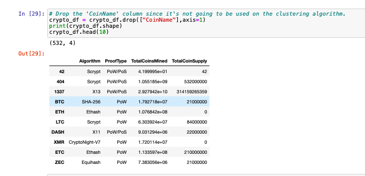

# Cryptocurrencies
Unsupevised Machine Learning to discover cryptocurrency trends 

Accountability Accounting, a prominent investment bank, is interested in offering a new cryptocurrency investment portfolio for its customers. The company, however, is lost in the vast universe of cryptocurrencies. So, they’ve asked me to create a report that includes what cryptocurrencies are on the trading market and how they could be grouped to create a classification system for this new investment.

# Preprocessing the Data for PCA

Using my knowledge of Pandas, I preprocessed the dataset. It is crucial that we preprocess our data before feeding it into our model, as the quality of the data and the relevant information that can be gleaned from it directly influences the model's capacity to learn. During the preprocessing we need to deal with:
* Null values  
* Missing values  
* Standardization: transform the values such that the mean of the values is 0 and the standard deviation is 1.  
* Handling Categorical Variables: Categorical variables are variables that are discrete rather than continuous in nature. For example, an item's color is a discrete variable, while its price is a continuous variable.  

 

# Reducing Data Dimensions Using PCA

# Clustering Cryptocurrencies Using K-means

# Visualizing Cryptocurrencies Results